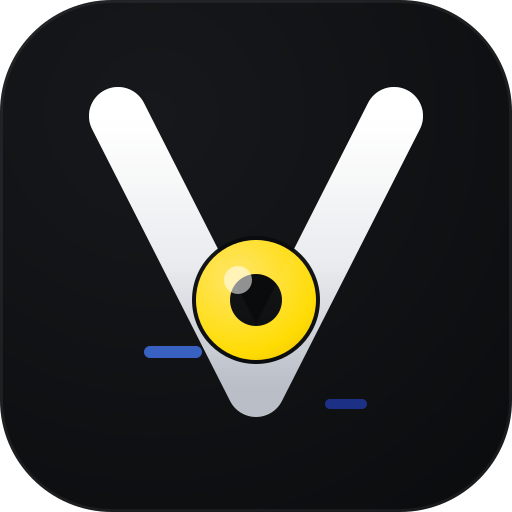

<div align="center">



# VYRA Studio

**Your camera. Your space.**

A personal camera, recording and desktop overlay studio — rebuilt from the ground
up for creators who live on their desktop.


</div>

---

## What is VYRA?

VYRA Studio turns your webcam into a **floating desktop camera** you can shape,
position and control without leaving your workflow — plus a fast recording
studio, screenshots, presets, a command palette and full keyboard control.

- **Zero friction**: open VYRA and your camera simply appears.
- **Power user**: press `Ctrl + Space` and control everything from the palette.

### Highlights

| | |
|---|---|
| 🎥 **Floating camera** | Always-on-top bubble with drag, snap, opacity, border and 7 shapes |
| 🎛 **Presets** | Coding, Recording, Meeting, Gaming, Minimal — plus your own |
| 🧲 **Smart Snap** | 9-point positioning grid with smooth animated transitions |
| 🎬 **Recording studio** | Camera, screen, or camera + screen via a hidden ffmpeg worker |
| 📸 **Screenshots** | Full screen or camera frame, straight to your folder of choice |
| ⌨️ **Keyboard-first** | Configurable global shortcuts for every core action |
| 🪟 **Single instance** | Launching again focuses the running app — never duplicates |
| 🖥 **Command palette** | `Ctrl + Space` to run any command instantly |
| 🌗 **HUD** | Subtle mic / camera / recording indicators on the bubble |
| 🔒 **Privacy-first** | All media processed locally. No analytics, no telemetry, no cloud |

---

## Install

Download the latest build from
[Releases](https://github.com/Keybachira/VYRA-STUDIO/releases)
(Windows `nsis`, Linux `AppImage`, macOS `dmg`), or run from source:

```bash
git clone https://github.com/Keybachira/VYRA-STUDIO.git
cd VYRA-STUDIO
npm install
npm run dev
```

## Development

```bash
npm run dev         # start the app in dev mode
npm run typecheck   # strict TS, node + web projects
npm run lint        # eslint + prettier
npm test            # vitest unit suite
npm run build       # production bundles to out/
npm run dist        # packaged installers (electron-builder)
npm run icons       # regenerate brand assets from brand/*.svg
```

See [DEVELOPMENT.md](docs/DEVELOPMENT.md) for the full guide.

## Linux & Omarchy

VYRA is Omarchy-first: a floating always-on-top camera that behaves as a native
layer under Hyprland/Wayland, with documented window rules and opt-in config.
See [OMARCHY.md](docs/OMARCHY.md) — a `vyra` CLI and native workspace awareness
are planned (Phase 5) and clearly marked as such.

## Shortcuts

| Action | Default |
|---|---|
| Command palette | `Ctrl + Space` |
| Toggle camera | `F9` |
| Start / stop recording | `F10` |
| Screenshot | `F8` |
| Toggle microphone | `Alt + M` |
| Apply preset 1 / 2 / 3 | `Alt + 1..3` |

Every shortcut is configurable in **Settings → Shortcuts**.
Full list: [SHORTCUTS.md](docs/SHORTCUTS.md).

## Architecture

Electron main process owns windows, OS integration and recording; the renderer
owns camera video and UI; everything crosses a typed, context-isolated IPC
bridge. Modular domains, Zustand stores, zero Node APIs in the renderer.

See [ARCHITECTURE.md](docs/ARCHITECTURE.md).

## Privacy

Camera and microphone streams never leave your machine. No accounts, no cloud,
no telemetry. See [PRIVACY.md](docs/PRIVACY.md).

## Roadmap

Instant replay buffer, camera effects, background segmentation, face framing,
automations and deeper Omarchy awareness are planned —
see [ROADMAP.md](docs/ROADMAP.md).

---

<div align="center">

**VYRA Studio** — Your camera. Your space.

</div>
